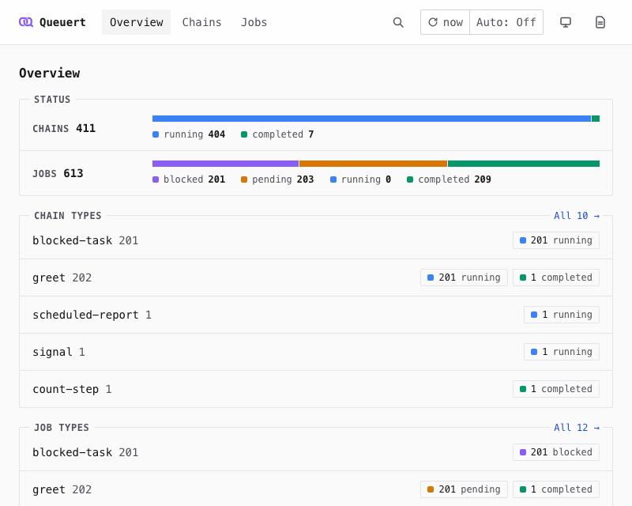
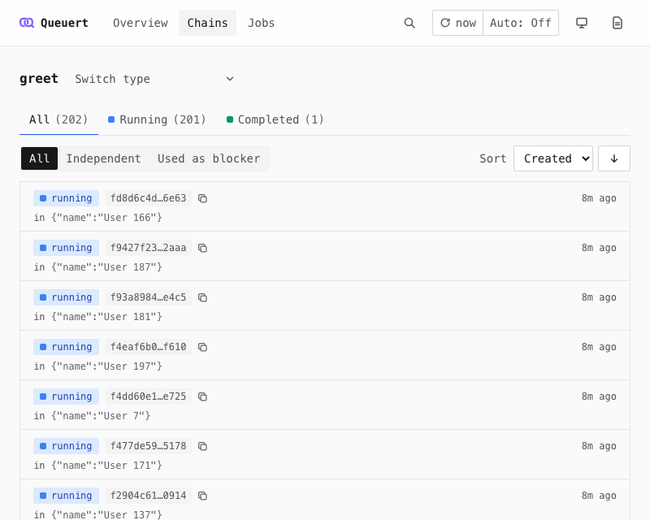
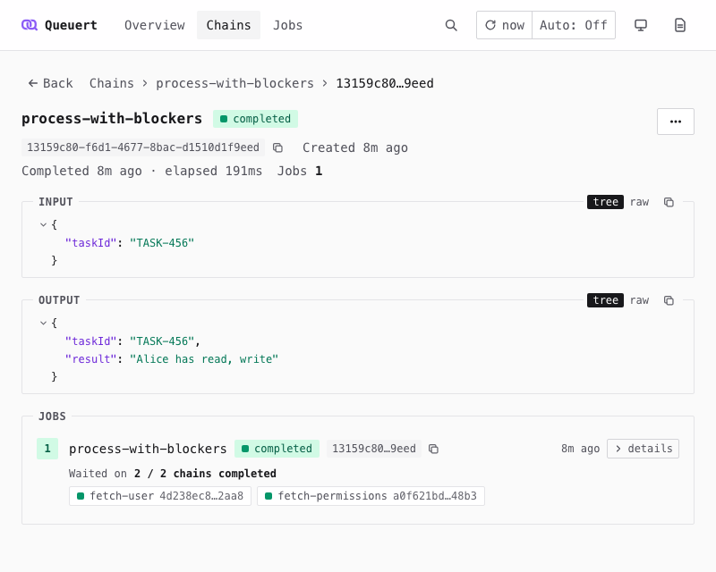
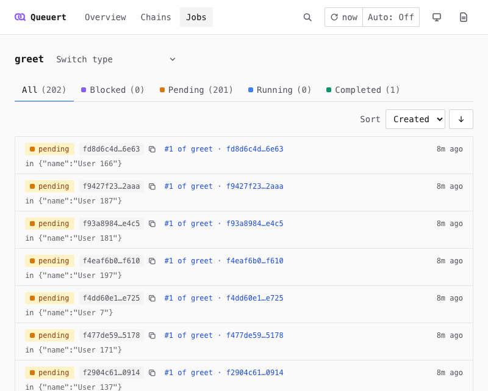
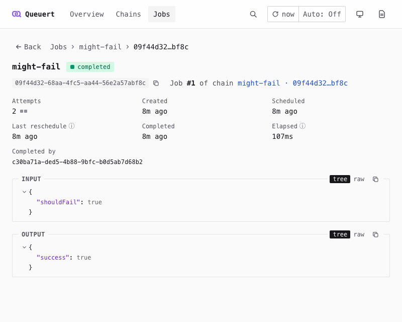

import { Aside, Badge, Steps } from "@astrojs/starlight/components";

`@queuert/dashboard` provides an embeddable web UI for observing chains and jobs. It mounts as a single `fetch` handler on your existing server -- no external build steps or runtime dependencies beyond `queuert`.

<Aside type="caution" title="Experimental">
  API may change between minor versions.
</Aside>

## Quick start

<Steps>

1. Install the package:

   ```bash
   npm install @queuert/dashboard
   ```

2. Create the dashboard with your Queuert client:

   ```ts
   import { createDashboard } from "@queuert/dashboard";

   const dashboard = await createDashboard({ client });
   ```

3. Mount it on your server:

   ```ts
   // Use with any server that accepts a fetch handler
   serve({ fetch: dashboard.fetch, port: 3000 });
   ```

   When mounting at a sub-path, set `basePath`:

   ```ts
   const dashboard = await createDashboard({
     client,
     basePath: "/internal/queuert",
   });
   ```

</Steps>

`createDashboard` accepts a Queuert `client` (created via `createClient`) and returns `{ fetch }` -- a standard web `fetch` handler. Pass it to any server runtime (Node.js, Bun, Deno, etc.). The handler serves both API routes and the pre-built frontend.

The dashboard provides:

- **Overview** -- Totals across all chain and job types, plus the busiest types of each kind
- **Chain and job types** -- Every type with its per-status counts
- **Chain and job lists** -- One type at a time, with status tabs, sorting, and input and output previews on every row
- **Chain detail** -- The chain's jobs in sequence, the blockers each job waited on, and the jobs in other chains that wait on this chain
- **Job detail** -- Input, output, the last error, attempt info, and the continuation link
- **Find by ID** -- Look up any chain or job by ID, across all types

Supports a small set of mutations (running a scheduled job now, deleting a chain) in addition to read queries. Add authentication middleware before the dashboard handler to restrict access.

## UI views

The top bar holds the navigation (Overview, Chains, Jobs), **Find by ID** (`⌘K` / `Ctrl+K`), a refresh control, a theme switch (System, Light, Dark), and a link to these docs. Every filter lives in the URL, so any view can be bookmarked or shared.

### Overview



The home page (`/`). A status panel shows a bar per kind with the totals of every status across all types — running and completed chains; blocked, pending, running and completed jobs — and two lists show the five chain types with the most running chains and the five job types with the most unfinished jobs. Counts stop at 10,000 per type and status, so a total that includes a capped count is shown as a lower bound (`≥`).

### Chain and job types

`/chains/types` and `/jobs/types` list every type as one row: the name, its total, and a chip per status that links to the list filtered by that status. A count shown as `10,000+` is capped. Filter the types by name (press `/` to focus the filter) and sort by name, total, or running count (job types can also sort by waiting = blocked + pending).

### Chain list



Lists the chains of one type, newest first by default. Status tabs (All, Running, Completed) show the count of each status; the chain-role switch narrows the list to independent chains or to chains used as blockers; the sort options depend on the selected status. Each row shows the status, chain ID and time, with one-line input and output previews below. More rows load as you scroll.

### Chain detail



Shows one chain with its jobs as a vertical sequence, oldest first. Each job shows its status, the last error and attempt count if it was rescheduled after an error (with a **Run now** button while the next attempt is still scheduled), and the blocker chains it waits on (or waited on) with a "done / total" count. Expand **Details** to see a job's input and, for the tail job, its output. Runs of three or more repeated completed jobs of the same type are folded into one item that can be expanded.

While the chain runs, its header names the current job and that job's status, since a running chain may be waiting on a blocked or pending job. The page reads top to bottom: the chain's details, its input, its output once it completes, **Blocked jobs**, and the chain's jobs. **Blocked jobs** lists jobs in other chains that declared this chain as a blocker. Those jobs keep that reference even after they finish, and a chain cannot be deleted while any job still references it -- the delete dialog says so up front and names the job whose chain must be deleted first.

### Job list



Lists the jobs of one type with tabs for All, Blocked, Pending, Running and Completed. Each row links to the job and to its chain (as "#2 of chain-type · chain-id"), and shows one-line input and, for a tail job, output previews. A warning icon marks an unfinished job whose last attempt failed; hover it for the error. Timing, attempts and the full error live on the job's page.

### Job detail



Shows one job, top to bottom: its details (attempts, timing, and the current attempt's worker and deadline while it runs, or who completed it), its last error if any, input, the job it continued to or its output, and the blocker chains it waited on. A pending job scheduled in the future gets a **Run now** button that makes it due immediately; a failure is reported under the button.

### Find by ID

Press `⌘K` (`Ctrl+K`) or click the find box (a search icon on narrow screens) and paste one or more IDs, separated by commas, spaces or new lines (up to 100). A single ID opens the chain or job directly; a chain and its head job share an ID, so for a head job you choose which to open. Several IDs open `/find`, which lists the matching chains and jobs and the IDs that were not found.

### Refreshing

Data does not update by itself unless you turn it on. The refresh button reloads the current view in place and shows how long ago it last loaded; its menu turns on auto-refresh every 15, 30 or 60 seconds, which pauses while the tab is hidden. A refresh never resets a list you have scrolled: when the top of the list has changed, a "List has changed · Show" banner lets you jump to the fresh list.

### Content Security Policy

The frontend uses no inline scripts and no external resources (the favicon is a `data:` URI, so `img-src` must allow `data:`), but its response decoding (seroval) relies on `eval`, so a CSP that blocks `unsafe-eval` breaks the dashboard. Strict CSPs are not supported today.

## Architecture

The dashboard is a self-contained package with two layers:

- **Backend**: A standard `fetch` handler with built-in routing (no framework dependency). Serves API routes that query the Queuert client's state adapter directly.
- **Frontend**: A SolidJS single-page application, pre-built as static JS/CSS and shipped within the package. No external build steps required at deploy time.

The dashboard works with the PostgreSQL and SQLite state adapters, which implement the required listing methods.

## Authentication

The dashboard does not include authentication or authorization. To restrict access, add middleware before the dashboard handler:

```ts
const server = serve({
  fetch: (request) => {
    if (!isAuthenticated(request)) {
      return new Response("Unauthorized", { status: 401 });
    }
    return dashboard.fetch(request);
  },
  port: 3000,
});
```

See [dashboard](https://github.com/kvet/queuert/tree/main/examples/dashboard) for a complete example.

## See Also

- [Job & Chain Queries](/queuert/guides/queries/) — Client query methods used by the dashboard
